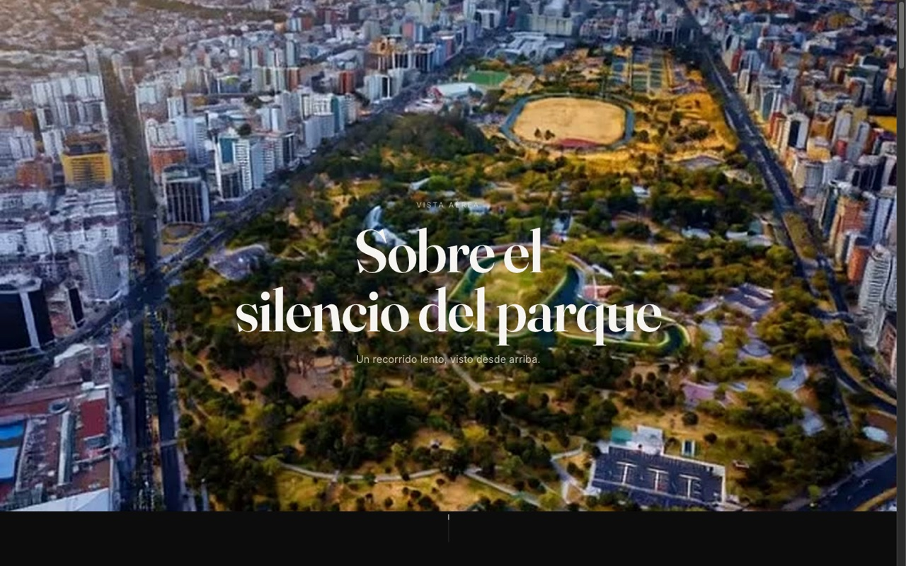

<div align="center">


<a href="https://fleremiasflemin20-maker.github.io/aerial-estudio/">
  
</a>

<br/><br/>


</div>

<br/>

<p align="center">
  
</p>

## Sobre el proyecto

Sitio de portfolio construido a partir de una toma aérea de dron. El video se descompuso en una secuencia de fotogramas que se reproduce en sincronía con el scroll, creando un recorrido lento y cinematográfico sobre el paisaje.

## Tecnologías

- HTML5 / CSS3 / JavaScript vanilla — sin frameworks ni build step
- Secuencia de frames renderizada en `<canvas>`, animada por scroll
- Tipografías `Fraunces` + `Inter`

## Ver el código localmente

```bash
git clone https://github.com/fleremiasflemin20-maker/aerial-estudio.git
cd aerial-estudio
npx serve .
```

<div align="center">

</div>
